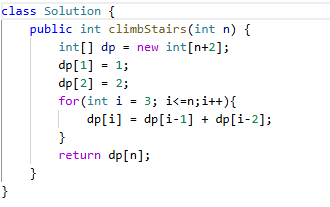

# 70. 爬楼梯

> 难度：简单 · 章节：动态规划

---

## 题目描述

假设你正在爬楼梯。需要 n 阶你才能到达楼顶。
每次你可以爬 1 或 2 个台阶。你有多少种不同的方法可以爬到楼顶？

示例 1：
- 输入：n = 2
- 输出：2
- 解释：有两种方法可以爬到楼顶。
1. 1 阶 + 1 阶
2. 2 阶

示例 2：
- 输入：n = 3
- 输出：3
- 解释：有三种方法可以爬到楼顶。
1. 1 阶 + 1 阶 + 1 阶
2. 1 阶 + 2 阶
3. 2 阶 + 1 阶

## 学霸笔记

Dp[i] 指i阶有几种方法爬到楼顶，初始化dp[1] = 1,dp[2] = 2开一层循环i（3）-n
Dp[i] = dp[i-1] + dp[i – 2] 最后return结束战斗

