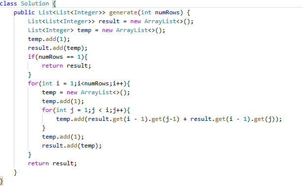

# 118. 杨辉三角

> 难度：简单 · 章节：动态规划

---

## 题目描述

给定一个非负整数 numRows，生成「杨辉三角」的前 numRows 行。

示例 1:
- 输入: numRows = 5
- 输出: [[1],[1,1],[1,2,1],[1,3,3,1],[1,4,6,4,1]]

示例 2:
- 输入: numRows = 1
- 输出: [[1]]

## 学霸笔记

初始化result，temp。temp add(1)，开两层循环，有模拟过程，外面i-numRows,里面j-i,里面先模拟下add1，再temp.add(result.get(i-1).get(j-2) + result.get(i-1).get(j-1)),再模拟add1,result加一下。结束战斗

