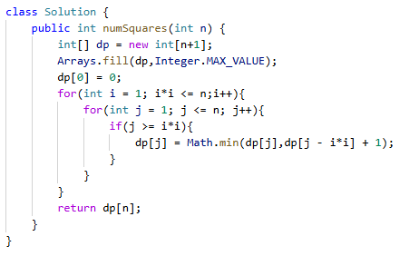

# 279. 完全平方数

> 难度：中等 · 章节：动态规划

---

## 题目描述

给你一个整数 n ，返回 和为 n 的完全平方数的最少数量 。
完全平方数 是一个整数，其值等于另一个整数的平方；换句话说，其值等于一个整数自乘的积。例如，1、4、9 和 16 都是完全平方数，而 3 和 11 不是。

示例 1：
- 输入：n = 12
- 输出：3
- 解释：12 = 4 + 4 + 4

## 学霸笔记

Dp[i] 定义指平方数组成到i最小次数，定义dp[0]=0,fill(…),开两层循环，外面i(i*i <=n)-n,。里面j(1)-n ，里面判断j >= i*i就dp[j] = Math.min(dp[j],dp[j – i*i] + 1) 最后return dp[n]结束战斗（因为1的存在所以不用判断没结果）

