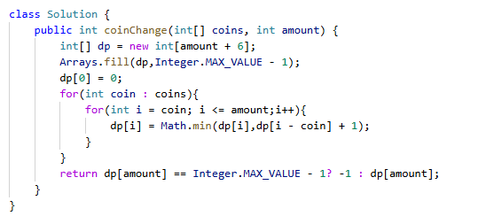

# 322. 零钱兑换

> 难度：中等 · 章节：动态规划

---

## 题目描述

给你一个整数数组 coins ，表示不同面额的硬币；以及一个整数 amount ，表示总金额。
计算并返回可以凑成总金额所需的 最少的硬币个数 。如果没有任何一种硬币组合能组成总金额，返回 -1 。
你可以认为每种硬币的数量是无限的。

示例 1：
- 输入：coins = [1, 5, 10, 25], amount = 41
- 输出：4
- 解释：25 + 10 + 5 + 1 = 41

示例 2：
- 输入：coins = [2], amount = 3
- 输出：-1

## 学霸笔记

dp[i] 指组成i块钱的最少次数。记得定义dp[0] = 0;Arrays.fill(dp,Integer.MAX_VALUE)
开两层循环，外面i(初始化1)-coins,里面j(初始化i)- I,
Dp[i] = Math.min(dp[i],dp[coin – j] + 1)最后return dp[n]，结束战斗!

