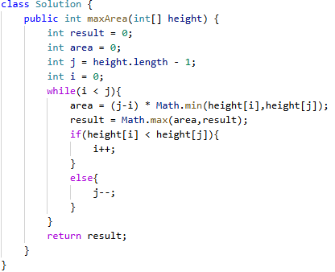

# 11. 盛最多水的容器

> 难度：中等 · 章节：双指针

---

## 题目描述

给定一个长度为 n 的整数数组 height 。有 n 条垂线，第 i 条线的两个端点是 (i, 0) 和(i,height[i]) 。找出其中的两条线，使得它们与 x 轴共同构成的容器可以容纳最多的水。返回容器可以储存的最大水量。

示例 1：
- 输入：[1,8,6,2,5,4,8,3,7]
- 输出：49
- 解释：图中垂直线代表输入数组 [1,8,6,2,5,4,8,3,7]。在此情况下，容器能够容纳水（表示为蓝色部分）的最大值为 49。

## 学霸笔记

双指针，开while(i头j尾)，math记录最大值面积，面积取决最短高度，i的边比较j的边，谁短谁移动(i++j--),最后return结束战斗

