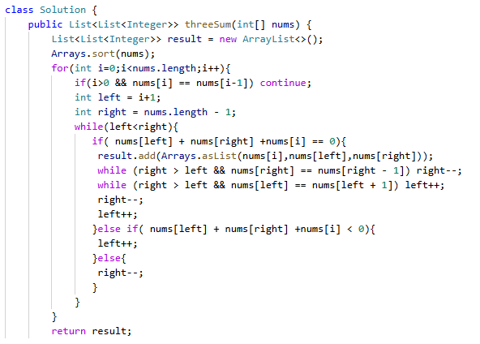

# 15. 三数之和

> 难度：中等 · 章节：双指针

---

## 题目描述

给你一个整数数组 nums ，判断是否存在三元组 [nums[i], nums[j], nums[k]] 满足 i != j、i != k 且 j != k ，同时还满足 nums[i] + nums[j] + nums[k] == 0 。请你返回所有和为 0 且不重复的三元组。注意：答案中不可以包含重复的三元组。

示例 1：
- 输入：nums = [-1,0,1,2,-1,-4]
- 输出：[[-1,-1,2],[-1,0,1]]

示例 2：
- 输入：nums = [0,1,1]
- 输出：[]

## 学霸笔记

定义List<List<的result,sort下方便剪枝，开两层循环，外面for i-n，剪枝(if i和-1一样就continue 保证不重复)和定义left(i右)和right(最右)，里面while用双指针，判断有无+++=0 加入result，while剪枝(左右往中间靠)，然后正常j++k--(加result都移，没加移一个).退循环return结束战斗

