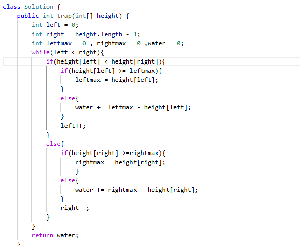

# 42. 接雨水

> 难度：困难 · 章节：双指针

---

## 题目描述

给定 n 个非负整数表示每个宽度为 1 的柱子的高度图，计算按此排列的柱子，下雨之后能接多少雨水。

示例 1：
- 输入：height = [0,1,0,2,1,0,1,3,2,1,2,1]
- 输出：6
- 解释：上面是由数组 [0,1,0,2,1,0,1,3,2,1,2,1] 表示的高度图，在这种情况下，可以接 6 个单位的雨水（蓝色部分表示雨水）。

示例 2：
- 输入：height = [4,2,0,3,2,5]
- 输出：9

## 学霸笔记

可用双指针，装逼可用前缀和，但是难背，弃了
定义左(0)右(边界),左max0右max0，开一层循环while来双指针，判断左右谁矮，矮的一边再开if判断高度和各自max比较，>=就更新max，小就接一波雨水+=max-矮边，最后指针往中间移，return面积，结束战斗

本类共 4 道题
