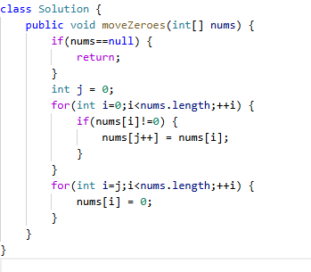

# 283. 移动零

> 难度：简单 · 章节：双指针

---

## 题目描述

给定一个数组 nums，编写一个函数将所有 0 移动到数组的末尾，同时保持非零元素的相对顺序。
请注意 ，必须在不复制数组的情况下原地对数组进行操作。

示例 1：
- 输入: nums = [0,1,0,3,12]
- 输出: [1,3,12,0,0]

示例 2：
- 输入: nums = [0]
- 输出: [0]

## 学霸笔记

变量j0，第一次for i-n，判断是不是0，不是就num[i]赋给num[j]并j++，开第二次fori(j)-n,此时numi都应该赋0，结束战斗

