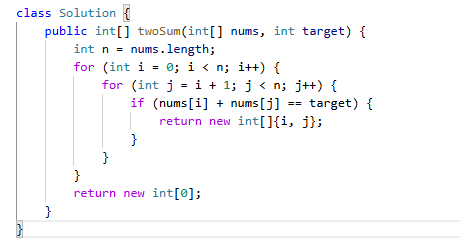
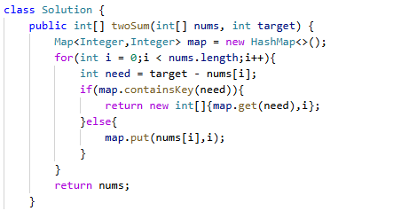

# 1. 两数之和

> 难度：简单 · 章节：哈希

---

## 题目描述

给定一个整数数组 nums 和一个整数目标值 target，请你在该数组中找出和为目标值 target 的那两个整数，并返回它们的数组下标。
你可以假设每种输入只会对应一个答案，并且你不能使用两次相同的元素。你可以按任意顺序返回答案。

示例 1：
- 输入：nums = [2,7,11,15], target = 9
- 输出：[0,1]
- 解释：因为 nums[0] + nums[1] == 9，返回 [0, 1] 。

示例 2：
- 输入：nums = [3,2,4], target = 6
- 输出：[1,2]

## 学霸笔记

两层循环暴力，我没意见，回去等通知写法。
正经点哈希表法，用int，int的map存key是nums[i],value是i，开for遍历一遍nums，if找map的key为target-nums[i]，找到return没找到加入新的。最后随便return个啥反正也走不到，对了 Map不会漏原因是两数之和必定是两个数，所以先塞进去必定会等后面的。结束战斗

