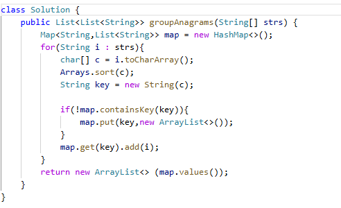

# 49. 字母异位词分组

> 难度：中等 · 章节：哈希

---

## 题目描述

给你一个字符串数组，请你将字母异位词组合在一起。可以按任意顺序返回结果列表。
字母异位词是由重新排列源单词的所有字母得到的一个新单词。

示例 1：
- 输入: strs = ["eat", "tea", "tan", "ate", "nat", "bat"]
- 输出: [["bat"],["nat","tan"],["ate","eat","tea"]]
- 输入: strs = [""]
- 输出: [[""]]

## 学霸笔记

开个map存，key是str ，value是要求的内容。For循环strs，里面new一个排序版str，这样好判断map.containsKey(key)，没有就加进去，最后return 构造新的list，内容是map.values()

