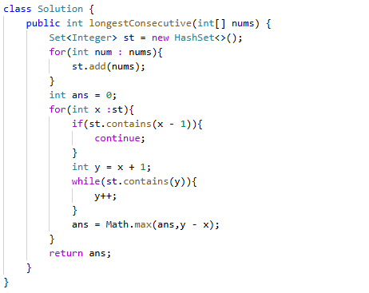

# 128. 最长连续序列

> 难度：中等 · 章节：哈希

---

## 题目描述

给定一个未排序的整数数组 nums ，找出数字连续的最长序列（不要求序列元素在原数组中连续）的长度。
请你设计并实现时间复杂度为 O(n) 的算法解决此问题。

示例 1：
- 输入：nums = [100,4,200,1,3,2]
- 输出：4
- 解释：最长数字连续序列是 [1, 2, 3, 4]。它的长度为 4。

示例 2：
- 输入：nums = [0,3,7,2,5,8,4,6,0,1]
- 输出：9

## 学霸笔记

用set（hashset），for加进去nums到set，开两层循环，外面set，判断contains(x-1),里面开while（y =x+1）用来找下一个，y++，退到外层Math.max记录一下最大值（y-x,原），结束战斗

本类共 4 道题
