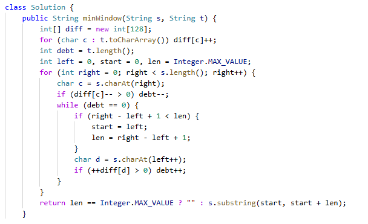

# 76. 最小覆盖子串

> 难度：困难 · 章节：子串

---

## 题目描述

给你一个字符串 s 、一个字符串 t 。返回 s 中涵盖 t 所有字符的最小子串。如果 s 中不存在涵盖 t 所有字符的子串，则返回空字符串 "" 。
注意：
- 对于 t 中重复字符，我们寻找的子字符串中该字符数量必须不少于 t 中该字符数量。
- 如果 s 中存在这样的子串，我们保证它是唯一的答案。

示例 1：
- 输入：s = "ADOBECODEBANC", t = "ABC"
- 输出："BANC"
- 解释：最小覆盖子串 "BANC" 包含来自字符串 t 的 'A'、'B' 和 'C'。

示例 2：
- 输入：s = "a", t = "a"
- 输出："a"

## 学霸笔记

其实可以不背，但还是讲讲思路吧，说不定以后想背了。
定义diff[c]表示c这个东西的差异，dept表示各种diff加起来总差异，开for t定义一遍t的diff东西有多少，退出来开第二个for i-s，判断有没有diff[i]，有就减少个差异，接着开while (dept=0)作用是更新窗口最小值和尝试缩小左边界，里面判断窗口大小比len，小就更新，接着看左边界右移diff和dept变化，退while for ,return s的sub串。

