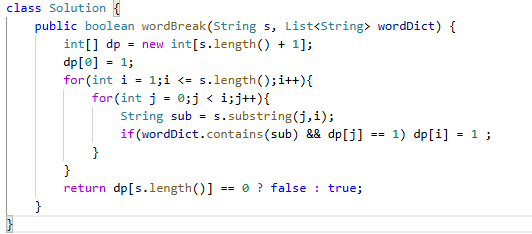

# 139. 单词拆分

> 难度：中等 · 章节：子串

---

## 题目描述

给你一个字符串 s 和一个字符串列表 wordDict 作为字典。如果可以利用字典中出现的一个或多个单词拼接出 s 则返回 true。
注意：不要求字典中出现的单词全部都使用，并且字典中的单词可以重复使用。

示例 1：
- 输入: s = "leetcode", wordDict = ["leet", "code"]
- 输出: true
- 解释: 返回 true 因为 "leetcode" 可以由 "leet" 和 "code" 拼接成。

示例 2：
- 输入: s = "applepenapple", wordDict = ["apple", "pen"]
- 输出: true
- 解释: 返回 true 因为 "applepenapple" 可以由 "apple" "pen" "apple" 拼接成。

## 学霸笔记

背诵：dp[i]指s字符在i前面全都可以由wordDict找到
开两个for，外面i-s，里面j-i，判断dp[j]&&substring(j,i) 就设置dp[i] = 1
直接起飞，结束战斗

本类共 5 道题
