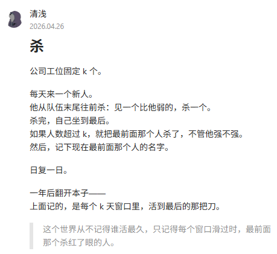

# 287. 寻找重复数

> 难度：中等 · 章节：技巧

---

## 题目描述

给定一个包含 n + 1 个整数的数组 nums ，其数字都在 [1, n] 范围内（包括 1 和 n），可知至少存在一个重复的整数。
假设 nums 只有 一个重复的整数 ，返回 这个重复的数 。
你设计的解决方案必须 不修改 数组 nums 且只用常量级 O(1) 额外空间。

示例 1：
- 输入：nums = [1,3,4,2,2]
- 输出：2

示例 2：
- 输入：nums = [3,1,3,4,2]
- 输出：3

## 学霸笔记

附录：力扣精彩评论
1：我是一个SB
2：woshisb
3：有人香车宝马，有人天赋异禀，还有人在力扣做题，只会看题解。
4：美团拼好饭专送一面
5：碧桂园保安一面
6：溏心男演员一面
7：吉野家店员一面
8：蜜雪冰城二面
9：感觉自己好没用
10：执行通过笑嘻嘻，一看击败百分七
11：有人相爱，有人在深夜开车去看海，有人LeetCode第一题做不出来
12：八嘎，这么难
13：玩偶姐姐三面，柚子猫一面，刘玥二面，娜娜二面
14:：

15：我是区
16：千帆过尽皆不是，轻舟已过万重山。循环遍历，我遇见更好，我也感谢曾遇，好湿好湿
