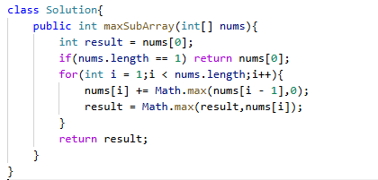

# 53. 最大子数组和

> 难度：中等 · 章节：普通数组

---

## 题目描述

给你一个整数数组 nums ，请你找出一个具有最大和的连续子数组（子数组最少包含一个元素），返回其最大和。
子数组是数组中的一个连续部分。

示例 1：
- 输入：nums = [-2,1,-3,4,-1,2,1,-5,4]
- 输出：6
- 解释：连续子数组 [4,-1,2,1] 的和最大，为 6 。

示例 2：
- 输入：nums = [1]
- 输出：1

## 学霸笔记

初始化result为num[0] 开一层for i-length 里面用Math记numi +=最大(0，i-1)表示取不取前一个，不取正好断了，用result记录历史最大num。

