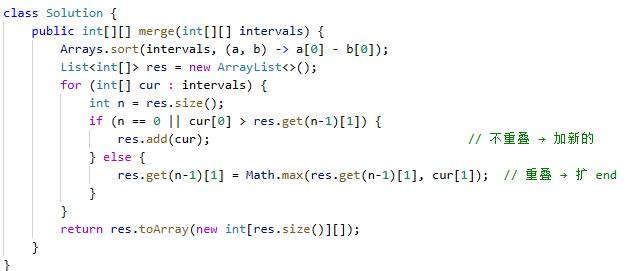

# 56. 合并区间

> 难度：中等 · 章节：普通数组

---

## 题目描述

以数组 intervals 表示若干个区间的集合，其中单个区间为 intervals[i] = [starti, endi] 。请你合并所有重叠的区间，并返回 一个不重叠的区间数组，该数组需恰好覆盖输入中的所有区间 。

示例 1：
- 输入：intervals = [[1,3],[2,6],[8,10],[15,18]]
- 输出：[[1,6],[8,10],[15,18]]
- 解释：区间 [1,3] 和 [2,6] 重叠, 将它们合并为 [1,6]。

## 学霸笔记

把合并区间想成水，有重叠就融成大区间了，没重叠就 new。
先sort排序[][]的左边也就是各个区间出发点，升序，定义res用List包一下后面转，开for-intervals，里面判断res有没有或者不重叠，加区间，有重叠就Math取一下结束点最大值，退出return toArray转一下结束战斗

