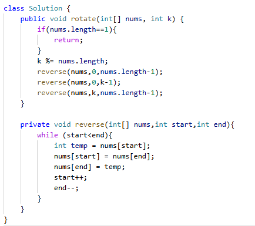

# 189. 轮转数组

> 难度：中等 · 章节：普通数组

---

## 题目描述

给定一个整数数组 nums，将数组中的元素向右轮转 k 个位置，其中 k 是非负数。

示例 1：
- 输入: nums = [1,2,3,4,5,6,7], k = 3
- 输出: [5,6,7,1,2,3,4]
- 解释:
向右轮转 1 步: [7,1,2,3,4,5,6]
向右轮转 2 步: [6,7,1,2,3,4,5]
向右轮转 3 步: [5,6,7,1,2,3,4]

示例 2：
- 输入：nums = [-1,-100,3,99], k = 2
- 输出：[3,99,-1,-100]

## 学霸笔记

定义k取余length以免超长，反转函数三次，一次(0,length-1)、二次(0,k-1)、三次(k,length-1),反转函数就双指针解决就行。
我说白了这种技巧性的题目就是死记硬背，和那个环形链表相遇记公式有什么区别，应试味拉满了，评论区还妙啊妙啊，我给到拉完了。

