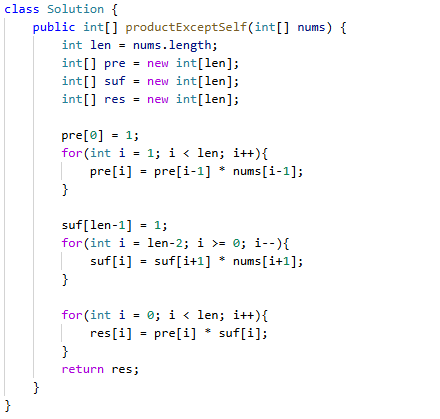

# 238. 除自身以外数组的乘积

> 难度：中等 · 章节：普通数组

---

## 题目描述

给你一个整数数组 nums，返回 数组 answer ，其中 answer[i] 等于 nums 中除 nums[i] 之外其余各元素的乘积 。
题目数据保证 数组 nums之中任意元素的全部前缀元素和后缀的乘积都在 32 位 整数范围内。
请 不要使用除法，且在 O(n) 时间复杂度内完成此题。

示例 1:
- 输入: nums = [1,2,3,4]
- 输出: [24,12,8,6]

## 学霸笔记

这道题想成构造两个sn，i前面的sn定义为pre；i后面的sn定义为suf。三次for，一次for i-length定义pre,二次for i--定义suf,三次for定义result,suf*pre 最后return result 结束战斗

