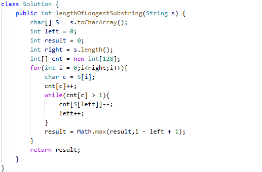

# 3. 无重复字符的最长子串

> 难度：中等 · 章节：滑动窗口

---

## 题目描述

给定一个字符串 s ，请你找出其中不含有重复字符的 最长子串 的长度。

示例 1：
- 输入: s = "abcabcbb"
- 输出: 3
- 解释: 因为无重复字符的最长子串是 "abc"，所以其长度为 3。

示例 2：
- 输入: s = "bbbbb"
- 输出: 1
- 解释: 因为无重复字符的最长子串是 "b"，所以其长度为 1。

## 学霸笔记

定义左0右边界，哈希int[] count存字母出现次数，开一个for i-length，里面用c转一下char存到count[c]++,进while（count[c]>1）来把左移到不重复，count[s[left]]--，最后left++退while，Math记一下最长的值i-left+1,return 结束战斗

