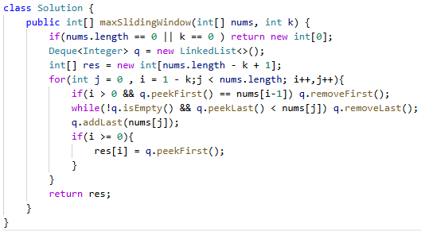

# 239. 滑动窗口最大值

> 难度：困难 · 章节：滑动窗口

---

## 题目描述

给你一个整数数组 nums，有一个大小为 k 的滑动窗口从数组的最左侧移动到数组的最右侧。你只可以看到在滑动窗口内的 k 个数字。滑动窗口每次只向右移动一位。
返回 滑动窗口中的最大值 。

示例 1：
- 输入：nums = [1,3,-1,-3,5,3,6,7], k = 3
- 输出：[3,3,5,5,6,7]
- 解释：
滑动窗口的位置 最大值
--------------- -----
[1 3 -1] -3 5 3 6 7 3
1 [3 -1 -3] 5 3 6 7 3
1 3 [-1 -3 5] 3 6 7 5
1 3 -1 [-3 5 3] 6 7 5
1 3 -1 -3 [5 3 6] 7 6
1 3 -1 -3 5 [3 6 7] 7

## 学霸笔记

维护一个双端队列q，for (i(窗口最左)，j0,n-窗口)，里面先if判断i大于0表示队列满了，且队列头==num i-1不在窗口了，该划走;继续新人入队开个while清理比他小的都remove；
清理完了退while 加自己numj，记录当下队头i(i要>0)进result，return结束战斗
总结：队列满清老大i，队列进新人从后往前while踢比自己弱，自己加到尾，自己最弱就直接加到尾

本类共 2 道题
