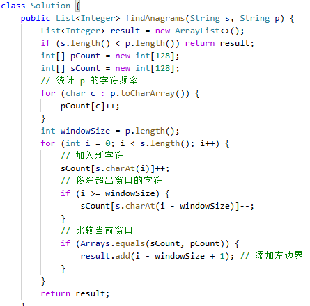

# 438. 找到字符串中所有字母异位词

> 难度：中等 · 章节：滑动窗口

---

## 题目描述

给定两个字符串 s 和 p，找到 s 中所有 p 的 异位词 的子串，返回这些子串的起始索引。不考虑答案输出的顺序。
异位词 指由相同字母重排列形成的字符串（包括相同的字符串）。

示例 1：
- 输入: s = "cbaebabacd", p = "abc"
- 输出: [0,6]
- 解释:
起始索引等于 0 的子串是 "cba", 它是 "abc" 的异位词。
起始索引等于 6 的子串是 "bac", 它是 "abc" 的异位词。

示例 2：
- 输入: s = "abab", p = "ab"
- 输出: [0,1,2]

## 学霸笔记

定义s、pcount频次作为哈希表查，判断plength是不是大于s，开两次for，第一次for统计pcount[i]++,退for 第二次for i-s,还是先统计，后if i>=(0开始所以=)窗口删除scount[i – 窗口]--,if scount和pcount相等就加result，return 结束战斗

