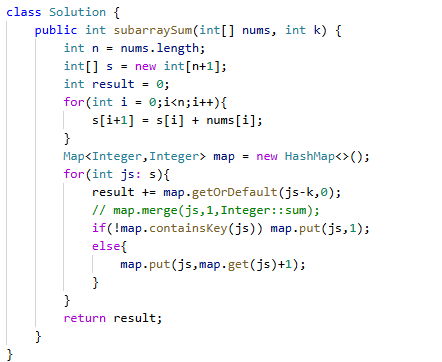

# 560. 和为 K 的子数组

> 难度：中等 · 章节：滑动窗口

---

## 题目描述

给你一个整数数组 nums 和一个整数 k ，请你统计并返回 该数组中和为 k 的连续子数组的个数 。
子数组是数组中元素的连续非空序列。

示例 1：
- 输入：nums = [1,1,1], k = 2
- 输出：2

示例 2：
- 输入：nums = [1,2,3], k = 3
- 输出：2

## 学霸笔记

因为要找连续的子数组，定义前缀和s[]存sn，map值存次数,key是sn,，开for定义一遍sn=s[n-1]+a[n-1],退for开新for sn,里面先result += 找key是sn-k的value，再if这次遍历的sn不在map里，存1否则+1.return 结束战斗

