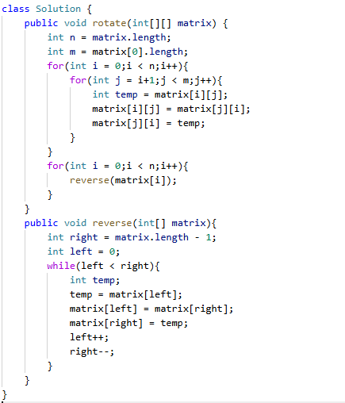

# 48. 旋转图像

> 难度：中等 · 章节：矩阵

---

## 题目描述

给定一个 n × n 的二维矩阵 matrix 表示一个图像。请你将图像顺时针旋转 90 度。
你必须在 原地 旋转图像，这意味着你需要直接修改输入的二维矩阵。请不要 使用另一个矩阵来旋转图像。

示例 1：
- 输入：matrix = [[1,2,3],[4,5,6],[7,8,9]]
- 输出：[[7,4,1],[8,5,2],[9,6,3]]

示例 2：
- 输入：matrix = [[5,1,9,11],[2,4,8,10],[13,3,6,7],[15,14,12,16]]
- 输出：[[15,13,2,5],[14,3,4,1],[12,6,8,9],[16,7,10,11]]

## 学霸笔记

技巧题，背：对角线反转一次+单独行反转一次 就行
开两层for，注意j只走矩形的一半三角形不然重复，内容就temp 、i->j, j->i退for。再开一层for丢matrix[i]进去reverse函数，函数reverse就双指针换一下ij就行，结束战斗

