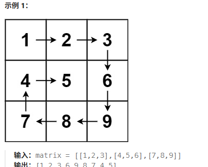
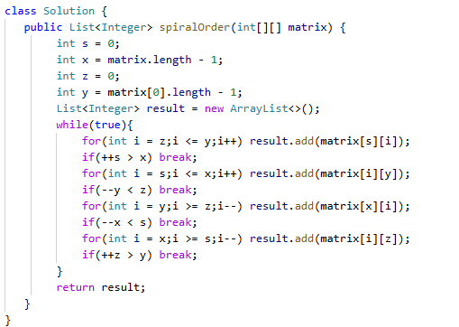

# 54. 螺旋矩阵

> 难度：中等 · 章节：矩阵

---

## 题目描述

给你一个 m 行 n 列的矩阵 matrix ，请按照 顺时针螺旋顺序 ，返回矩阵中的所有元素。

## 学霸笔记

模拟题，想成贪吃蛇，回型遍历四个方向一圈一圈就行。定义上下左右，开while true一直循环里面四次for，第一次左到右，加到result；for外判断++上 大于 下，break，其他三个方向继续…return result结束战斗

