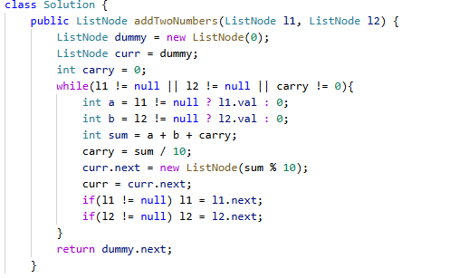

# 2. 两数相加

> 难度：中等 · 章节：链表

---

## 题目描述

给你两个 非空 的链表，表示两个非负的整数。它们每位数字都是按照 逆序 的方式存储的，并且每个节点只能存储 一位 数字。
请你将两个数相加，并以相同形式返回一个表示和的链表。
你可以假设除了数字 0 之外，这两个数都不会以 0 开头。

示例 1：
- 输入：l1 = [2,4,3], l2 = [5,6,4]
- 输出：[7,0,8]
- 解释：342 + 465 = 807

示例 2：
- 输入：l1 = [9,9,9,9], l2 = [9,9,9]
- 输出：[8,9,9,0,1]

## 学霸笔记

逻辑不直接，直接开背吧。定义虚拟头和进位carry，开while条件是两个链表还有或者进位还有一个成立就行，里面算sum(别忘了val可能null要？判断下) carry用/，next指向构造的node,值就是%10，自己curr前进，链表l12前进，return dummy.next结束战斗

