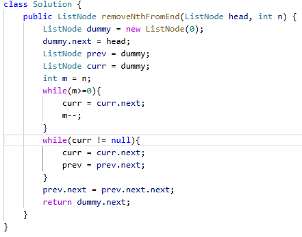

# 19. 删除链表的倒数第 N 个结点

> 难度：中等 · 章节：链表

---

## 题目描述

给你一个链表，删除链表的倒数第 n 个结点，并且返回链表的头结点。

示例 1：
- 输入：head = [1,2,3,4,5], n = 2
- 输出：[1,2,3,5]

示例 2：
- 输入：head = [1], n = 1
- 输出：[]

## 学霸笔记

快指针先跑n个，慢指针后跑，到快指针链表完结时候就正好慢指针指到要删，因为链表不好倒退，就可以前面快指针多跑一个，让next = next.next 后return 虚拟头next结束战斗

