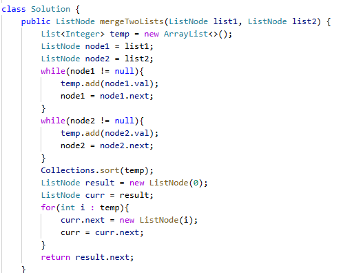

# 21. 合并两个有序链表

> 难度：简单 · 章节：链表

---

## 题目描述

将两个升序链表合并为一个新的 升序 链表并返回。新链表是通过拼接给定的两个链表的所有节点组成的。

示例 1：
- 输入：l1 = [1,2,4], l2 = [1,3,4]
- 输出：[1,1,2,3,4,4]

示例 2：
- 输入：l1 = [], l2 = []
- 输出：[]

## 学霸笔记

用禁忌之力Collections的sort排序一下，在重新构造一个链表return就行。注意int[]是Arrays的sort，list是Collections的，result的虚拟头，return next才指真头，结束战斗

