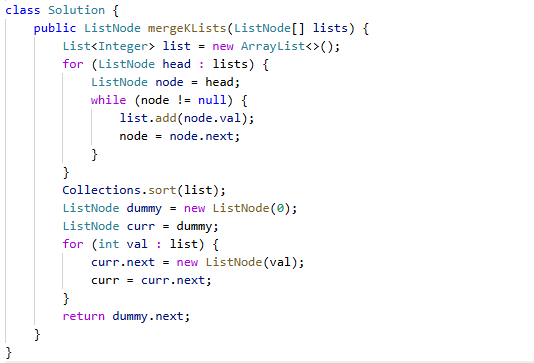

# 23. 合并 K 个升序链表

> 难度：困难 · 章节：链表

---

## 题目描述

给你一个链表数组，每个链表都已经按升序排列。
请你将所有链表合并到一个升序链表中，返回合并后的链表。

示例 1：
- 输入：lists = [[1,4,5],[1,3,4],[2,6]]
- 输出：[1,1,2,3,4,4,5,6]

示例 2：
- 输入：lists = []
- 输出：[]

## 学霸笔记

我合并格调，不做。
狗不做我做，这题直接用禁忌之力list的sort解决。别管什么优先队列分治合并了。吃我一击吧。

