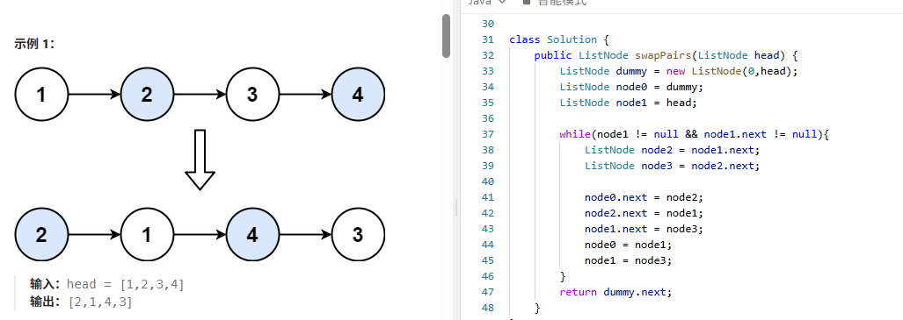

# 24. 两两交换链表中的节点

> 难度：中等 · 章节：链表

---

## 题目描述

给你一个链表，两两交换其中相邻的节点，并返回交换后链表的头节点。你必须在不修改节点内部的值的情况下完成本题（即，只能进行节点交换）。

示例 1：
- 输入：head = [1,2,3,4]
- 输出：[2,1,4,3]

示例 2：
- 输入：head = []
- 输出：[]

## 学霸笔记

用虚拟头指head，while至少两个节点开始，定义node23方便指，0指2，2指1，1指3，指针变完了该节点前进，0变1，1变3，最后return 虚拟头next结束战斗。

