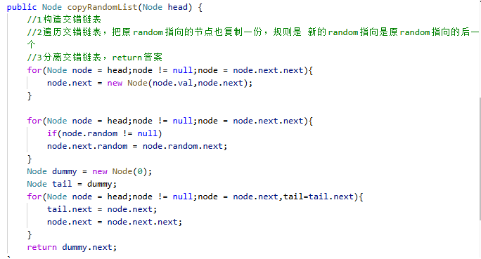
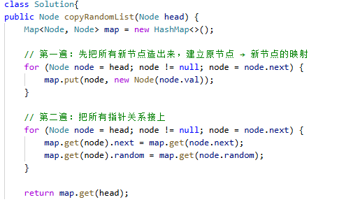

# 138. 随机链表的复制

> 难度：中等 · 章节：链表

---

## 题目描述

给你一个长度为 n 的链表，每个节点包含一个额外增加的随机指针 random ，该指针可以指向链表中的任何节点或空节点。
构造这个链表的 深拷贝。 深拷贝应该正好由 n 个 全新 节点组成，其中每个新节点的值都设为其对应的原节点的值。新节点的 next 指针和 random 指针也都应指向复制链表中的新节点，并使原链表和复制链表中的这些指针能够表示相同的链表状态。复制链表中的指针都不应指向原链表中的节点 。
返回复制链表的头节点。

示例 1：
- 输入：head = [[7,null],[13,0],[11,4],[10,2],[1,0]]
- 输出：[[7,null],[13,0],[11,4],[10,2],[1,0]]

示例 2：
- 输入：head = [[1,1],[2,1]]
- 输出：[[1,1],[2,1]]

## 学霸笔记

看了好像优先级不高，没人面，看遍思路过了。
要复制一遍很简单，但是random指向可能在后面还没构造完，想到哈希表法，但是这个要遍历两次(而且比这个难背)，用在原链表插入一个原链表ab->aa`bb`…，这样random就好插了，后面再分离一波结束战斗
又看了一眼好像哈希表法更好背，我有点傻逼了，for第一遍单纯map赋值让map存key 原 value 新 不涉及next和random，for第二遍赋值next和random最后return结束战斗

