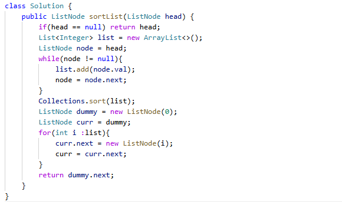

# 148. 排序链表

> 难度：中等 · 章节：链表

---

## 题目描述

给你链表的头结点 head ，请将其按 升序 排列并返回 排序后的链表 。
进阶：
- 你可以在 O(n log n) 时间复杂度和常数级空间复杂度下，对链表进行排序吗？

示例 1：
- 输入：head = [4,2,1,3]
- 输出：[1,2,3,4]

示例 2：
- 输入：head = [-1,5,3,4,0]
- 输出：[-1,0,3,4,5]

## 学霸笔记

一遍过，用禁忌之力就是爽。

