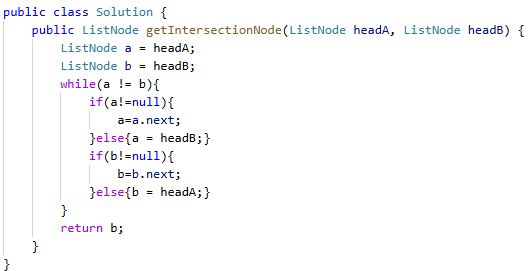

# 160. 相交链表

> 难度：简单 · 章节：链表

---

## 题目描述

给你两个单链表的头节点 headA 和 headB ，请你找出并返回两个单链表相交的起始节点。如果两个链表不存在相交节点，返回 null 。
图示两个链表在节点 c1 开始相交：
题目数据 保证 整个链式结构中不存在环。
注意，函数返回结果后，链表必须 保持其原始结构 。

示例 1：
- 输入：intersectVal = 8, listA = [4,1,8,4,5], listB = [5,6,1,8,4,5], skipA = 2, skipB = 3
- 输出：Intersected at '8'
- 解释：相交节点的值为 8 （注意，如果两个链表相交则不能为 0）。

示例 2：
- 输入：intersectVal = 0, listA = [2,6,4], listB = [1,5], skipA = 3, skipB = 2
- 输出：null
- 解释：两个链表不相交，因此返回 null。

## 学霸笔记

记住while遍历，短的遍历完了换头继续走，相遇就是相交点。
定义a b node以免头被污染，开while(ab不相等)两种情况都考虑了，有香蕉就没毛，没有香蕉就都是null情况，也退的出来while ，里面判断是不是null是就换头不是就next；return结束战斗

