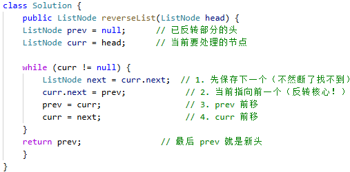

# 206. 反转链表

> 难度：简单 · 章节：链表

---

## 题目描述

给你单链表的头节点 head ，请你反转链表，并返回反转后的链表。

示例 1：
- 输入：head = [1,2,3,4,5]
- 输出：[5,4,3,2,1]

示例 2：
- 输入：head = [1,2]
- 输出：[2,1]

## 学霸笔记

反转就背：现 指向 前 ，前 变 现，现 变 后；链表题return时候要看curr有没有走过，走过了就用prev。

