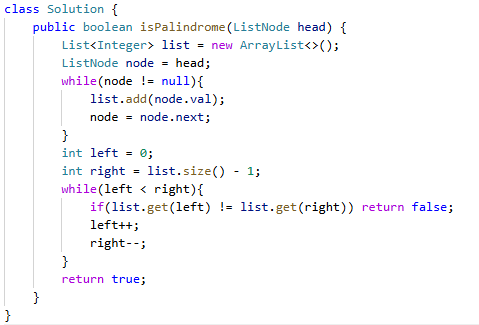

# 234. 回文链表

> 难度：简单 · 章节：链表

---

## 题目描述

给你一个单链表的头节点 head ，请你判断该链表是否为回文链表。如果是，返回 true ；否则，返回 false 。

示例 1：
- 输入：head = [1,2,2,1]
- 输出：true

示例 2：
- 输入：head = [1,2]
- 输出：false

## 学霸笔记

我的简单思路是转list后用双指针判断= ！=，做的好回去等通知吧。优化思路是快慢指针跑完就是中间点和终点，从中间点开始反转后半链表，再做比较判断就行。 评价为没必要记住茴四种写法

